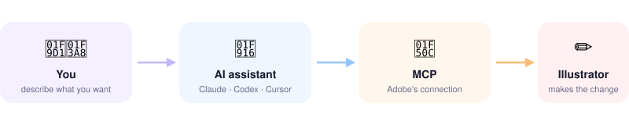

# Agent Illustrator Tools

Use a normal AI assistant — **Claude, Codex, or Cursor** — to do real work in
**Adobe Illustrator (Beta)**: recolor artwork, line things up, tidy files. You
just say what you want in plain words, and the AI makes the change for you.



## 👉 Start here

**[Open the setup guide →](docs/non-developer-start-here.md)**

It's a short, picture-by-picture walkthrough: connect Illustrator to your AI
assistant, then make your first edit. **No coding.** That one page is all most
people need.

## Good to know

- ✅ Works with any AI assistant that supports Adobe's MCP connection (Claude, Codex, Cursor…)
- ✅ Free, open, and safe to copy
- ❌ It's a guide, **not** an app you install inside Illustrator
- 🔒 Never put passwords, tokens, or client files in here → [what to keep private](docs/public-boundary.md)

## Need a hand?

- Picking or setting up your AI tool → [AI tool connections](docs/ai-tool-connections.md)
- Your first real task → [recolor walkthrough](workflows/illustrator-recolor.md)
- Adobe's own help → [Connect Illustrator to AI tools](https://helpx.adobe.com/illustrator/desktop/connect-with-other-apps-and-tools/connect-illustrator-to-ai-tools.html)

---

<details>
<summary><b>For developers / advanced users</b> (reference docs, scripts, platform listings)</summary>

<br>

**Reference**
- [docs/adobe-illustrator-mcp-tools.md](docs/adobe-illustrator-mcp-tools.md) — the 43 Illustrator MCP functions, attributes, and safety notes
- [docs/illustrator-menu-command-links.md](docs/illustrator-menu-command-links.md) · [data/illustrator-menu-commands.csv](data/illustrator-menu-commands.csv) — Illustrator menu command index (from the MIT-licensed AiCommandPalette set). Generated by [tools/build-menu-command-links.py](tools/build-menu-command-links.py) — do not hand-edit the `.md`.

**Workflows**
- [workflows/illustrator-recolor.md](workflows/illustrator-recolor.md) — recolor sequence (appearance → preview → preflight → export)
- [workflows/design-qa-with-ollama.md](workflows/design-qa-with-ollama.md) — optional local vision QA on exported PNGs (Ollama)
- [workflows/ollama-qwen-gemma-vision.md](workflows/ollama-qwen-gemma-vision.md) — Qwen2.5-VL / Gemma 3 presets
- [workflows/mcp-listener-environment.md](workflows/mcp-listener-environment.md) — local HTTP listener for MCP/MCPO experiments

**Local helper scripts** (Python standard library only — no `pip`/`npm` install)
```bash
# Optional MCP listener
python3 tools/listener-playground/listener.py --host 127.0.0.1 --port 8765

# Optional Ollama vision on an exported PNG
ollama pull llava
python3 tools/ollama-vision/ollama_vision.py --prompt "Flag clipping or misalignment." --image ./preview.png
```
Optional `OLLAMA_*` settings live in [.env.example](.env.example).

**Illustrator Claw**
- [docs/illustrator-claw-public-setup.md](docs/illustrator-claw-public-setup.md) · [docs/illustrator-claw-automation-blueprints.md](docs/illustrator-claw-automation-blueprints.md)
- Skill: [skills/illustrator-claw/SKILL.md](skills/illustrator-claw/SKILL.md) (`$illustrator-claw`)

**Platform listing files**

| Platform | File |
|---|---|
| ClawHub | `clawhub.yaml` |
| OpenClaw | `skills/illustrator-claw/agents/openclaw.yaml` |
| Codex | `skills/illustrator-claw/agents/openai.yaml` |
| Claude Code | `skills/illustrator-claw/agents/claude.yaml` |
| Adobe Exchange | `adobe-exchange.yaml` |

**Project**
- [CONTRIBUTING.md](CONTRIBUTING.md) · [SECURITY.md](SECURITY.md) · [docs/public-boundary.md](docs/public-boundary.md)
- Adobe docs: [About AI tools](https://helpx.adobe.com/au/illustrator/desktop/connect-with-other-apps-and-tools/about-using-ai-tools-with-illustrator.html) · [Connect to AI tools](https://helpx.adobe.com/illustrator/desktop/connect-with-other-apps-and-tools/connect-illustrator-to-ai-tools.html) · [Work with documents](https://helpx.adobe.com/illustrator/desktop/connect-with-other-apps-and-tools/work-with-illustrator-documents-from-ai-tools.html)

</details>
