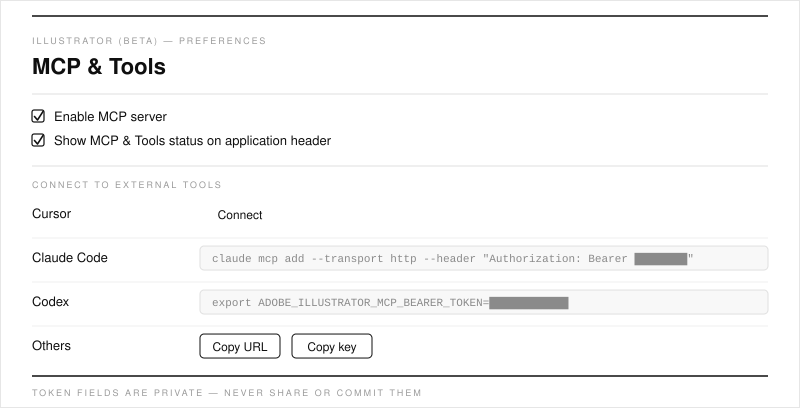

# Start Here — A Visual Guide for Designers

No coding required. This page walks you through connecting an AI assistant
(Claude, Codex, or Cursor) to **Adobe Illustrator (Beta)** so you can recolor,
align, and tidy artwork by just *describing* what you want.

## What this actually is

It's a set of plain-language instructions — not an app you install inside
Illustrator. You type a request to an AI assistant; the assistant makes the
change in Illustrator for you.


- **You** — describe the result you want ("make the logo navy blue").
- **AI tool** — Claude, Codex, or Cursor turns your words into Illustrator actions.
- **MCP** — the secure built-in connection between the two.
- **Illustrator (Beta)** — where your artwork actually changes.

## Before you start

| You need | Why |
|---|---|
| **Adobe Illustrator (Beta)** installed | This only works in the Beta build |
| **One AI tool**: Claude, Codex, or Cursor | This is what you'll talk to |
| 10 quiet minutes | First-time setup only — after that it's instant |

You do **not** need Git, Python, Node, or any developer tools to use the
workflows.

## Step 1 — Open the connection panel in Illustrator

Open Illustrator (Beta), then open **Preferences** (the button in the top bar,
or **Illustrator → Settings** on Mac). In the left list, click **MCP & Tools**.

Tick **Enable MCP server**. You'll see a panel like this:



> Tip: tick **Show MCP & Tools status on application header** and a small
> **MCP & Tools** status chip appears at the top of the window for quick access.

> **Adobe's official illustrated walkthrough:**
> [Connect Illustrator (Beta) to AI tools](https://helpx.adobe.com/illustrator/desktop/connect-with-other-apps-and-tools/connect-illustrator-to-ai-tools.html)

## Step 2 — Connect your AI tool

In the **Connect to external tools** section, set up your tool:

- **Cursor** — click **Connect** next to Cursor. Cursor opens automatically and
  shows an **Install** button. Click **Install**. Done.
- **Claude Code** — copy the command shown in the **Claude Code** row (it starts
  with `claude mcp add …`), paste it into Terminal, and press Enter. Adobe also
  offers an **"Adobe for creativity"** connector inside the Claude desktop app.
- **Codex** — copy the line from the **Codex** row (it sets a bearer-token
  environment variable) into your Codex setup.
- **Anything else** — use the **Others** row: **Copy URL** and **Copy key** into
  your tool's MCP configuration.

> **Keep your token private.** The Claude Code / Codex / Others rows contain a
> secret bearer token (shown as `••••••` in the picture above). Never paste it
> into this repo, a chat, a commit, or a screenshot. It also changes every time
> Illustrator restarts. See [public-boundary.md](public-boundary.md).

## Step 3 — Test that it worked

1. In Illustrator, open or create any document so it's the active one.
2. In your AI tool, type a simple prompt:

   ```text
   Create a document.
   ```

3. If the connection works, the tool asks for permission to proceed. Say yes.

That's it — you're connected.

## Step 4 — Do something real

Try your first useful task. A safe, read-only one to start:

```text
List the open Illustrator documents. If one is open, show me the active
artboard and a preview. Don't change anything yet.
```

When you're ready to make changes, follow the step-by-step
[recolor workflow](../workflows/illustrator-recolor.md).

## A few golden rules

- **Start read-only.** Ask the AI to *look* before it *changes* anything.
- **Work on a copy.** Test on a disposable file first, not client artwork.
- **Keep secrets out.** No tokens, keys, client names, or local paths in this
  repo. See [public-boundary.md](public-boundary.md).

## If you get stuck

| Problem | Try this |
|---|---|
| Can't find **MCP & Tools** | It's under **Preferences** (top bar, or **Illustrator → Settings**), in the left list. Confirm you're in Illustrator **(Beta)** |
| AI tool can't reach Illustrator | Make sure a document is open and the connection in **MCP & Tools** still shows as connected |
| Nothing happens after a prompt | Re-open the **MCP & Tools** panel and re-click **Connect** |

Adobe's official help:
[Connect to AI tools](https://helpx.adobe.com/illustrator/desktop/connect-with-other-apps-and-tools/connect-illustrator-to-ai-tools.html)
·
[About AI tools in Illustrator](https://helpx.adobe.com/illustrator/desktop/connect-with-other-apps-and-tools/about-using-ai-tools-with-illustrator.html)

## Want more detail?

- Picking/setting up a specific tool → [ai-tool-connections.md](ai-tool-connections.md)
- The full recolor walkthrough → [../workflows/illustrator-recolor.md](../workflows/illustrator-recolor.md)
- What must stay private → [public-boundary.md](public-boundary.md)
